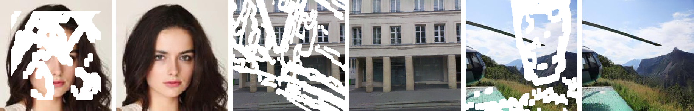
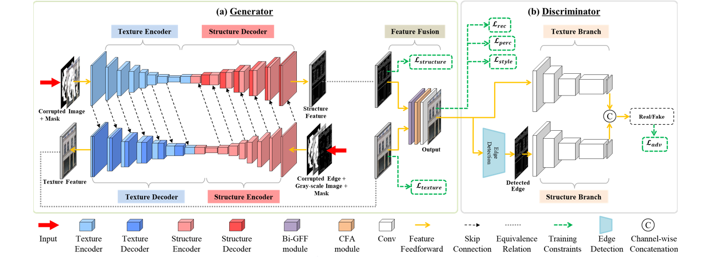

# CTSDG



### [Paper](https://arxiv.org/pdf/2108.09760.pdf) | [Pre-trained Models](https://drive.google.com/drive/folders/1lcATVc_U7plyEI__j5NWKCmKV_MNuhwq?usp=sharing) | [BibTex](https://github.com/Xiefan-Guo/CTSDG#citation)

**Image Inpainting via Conditional Texture and Structure Dual Generation**<br>

_Xiefan Guo, Hongyu Yang, Di Huang_<br>
In ICCV'2021

## Introduction

__Generator.__ Image inpainting is cast into two subtasks, _i.e._, _structure-constrained texture synthesis_ (left, blue) and _texture-guided structure reconstruction_ (right, red), and the two parallel-coupled streams borrow encoded deep features from each other. The Bi-GFF module and CFA module are stacked at the end of the generator to further refine the results. 

__Discriminator.__ The texture branch estimates the generated texture, while the structure branch guides structure reconstruction.



## Prerequisites

- Python >= 3.6
- PyTorch >= 1.0
- NVIDIA GPU + CUDA cuDNN

## Getting Started

### Installation

- Clone this repo:

```
git clone https://github.com/Xiefan-Guo/CTSDG.git
cd CTSDG
```

- Install PyTorch and dependencies from [http://pytorch.org](http://pytorch.org/)
- Install python requirements:

```
pip install -r requirements.txt
```
### Datasets

**Image Dataset.** We evaluate the proposed method on the [CelebA](http://mmlab.ie.cuhk.edu.hk/projects/CelebA.html), [Paris StreetView](https://github.com/pathak22/context-encoder), and [Places2](http://places2.csail.mit.edu/) datasets, which are widely adopted in the literature. 

**Mask Dataset.** Irregular masks are obtained from [Irregular Masks](https://nv-adlr.github.io/publication/partialconv-inpainting) and classified based on their hole sizes relative to the entire image with an increment of 10%.

### Training

Analogous to PConv by [_Liu et.al_](https://arxiv.org/abs/1804.07723), initial training followed by finetuning are performed. 

```
python train.py \
  --image_root [path to image directory] \
  --mask_root [path mask directory]

python train.py \
  --image_root [path to image directory] \
  --mask_root [path to mask directory] \
  --pre_trained [path to checkpoints] \
  --finetune True
```

__Distributed training support.__ You can train model in distributed settings.

```
python -m torch.distributed.launch --nproc_per_node=N_GPU train.py
```

### Testing

To test the model, you run the following code.

```
python test.py \
  --pre_trained [path to checkpoints] \
  --image_root [path to image directory] \
  --mask_root [path to mask directory] \
  --result_root [path to output directory] \
  --number_eval [number of images to test]
```

## Citation

If any part of our paper and repository is helpful to your work, please generously cite with:

```
@InProceedings{Guo_2021_ICCV,
    author    = {Guo, Xiefan and Yang, Hongyu and Huang, Di},
    title     = {Image Inpainting via Conditional Texture and Structure Dual Generation},
    booktitle = {Proceedings of the IEEE/CVF International Conference on Computer Vision (ICCV)},
    month     = {October},
    year      = {2021},
    pages     = {14134-14143}
}
```